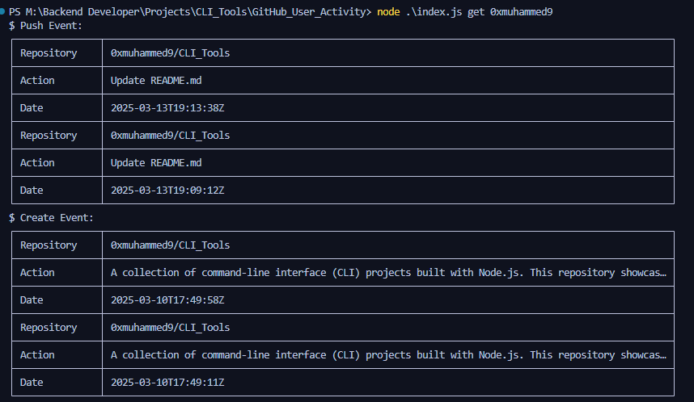

# 🚀 GitHub User Activity
A simple command-line interface (CLI) tool to fetch and display the recent activity of a GitHub user. This project demonstrates how to work with the GitHub API, handle JSON data, and build a user-friendly CLI application using Node.js.

## ✨ Features
- Fetch recent public events for any GitHub user.
- Display events in organized tables, grouped by event type (e.g., `PushEvent`, `CreateEvent`).
- Lightweight and easy to use from the terminal.

## 📥 Installation

Make sure you have Node.js installed. Then, clone the repository and install dependencies:

```sh
git clone <repo-url>
cd task-tracker
npm install
```
## 📋 Usage
Run the CLI tool by providing a GitHub username as an argument.

### 🛠️ Commands
#### Examble 
```sh 
node index.js <username>
```
#### Output



