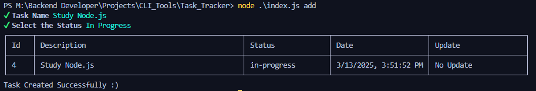

# Project From : 
[Roadmap.sh](https://roadmap.sh/projects/task-tracker)
# ✅ Task Tracker

<br/>

Task Tracker is a simple command-line interface (CLI) tool that helps users manage and track their tasks efficiently. Users can add, list, update, and delete tasks using this CLI application.


## 🚀 Features

- Add, remove, update, and list tasks.
- Track completed and pending tasks.
- User-friendly command-line interface.

## 📥 Installation

Make sure you have Node.js installed. Then, clone the repository and install dependencies:

```sh
git clone <repo-url>
cd task-tracker
npm install
```

## ⚡Usage

After installation, you can run the CLI using:

```sh
node index.js --help
```


<br />

```sh
node index.js <command> [options]
```

## 🛠️ Commands

### 1- `add`

Description:
Allows users to create a new task with a name, status, and date.

```sh
node index.js add
```

The CLI will prompt the user for task details (e.g., task name, status, and due date).
<br />



### 2- `delete`

Description:
Allows users to Deletes a task by its Task ID.

```sh
node index.js delete -i <TaskID> #Delete the task with ID 3.

```

Options:

- `-i, --id <number>` → Specifies the Task ID to delete.

### 3- `list`

Displays a list of tasks based on the specified filter.

```sh
node index.js list [options]
```

Options:

- `-a, --all` → Lists all tasks.
- `-d, --done` → Lists only completed tasks.
- `-t, --todo` → Lists tasks that are yet to be started.
- `-p, --progress` → Lists tasks that are currently in progress.

<br />

```sh
node index.js list -a   # List all tasks
node index.js list -d   # List only completed tasks
node index.js list -t   # List only to-do tasks
node index.js list -p   # List only in-progress tasks
```


### 4- `update`

Updates the status of a task using its Task ID.

```sh
node index.js update -i <TaskID> -s <status>
```

Options:

- `-i, --id <number>` → Specifies the Task ID.
- `-s, --status <string>` → Sets the new status of the task (todo, in-progress, done).

<br />

```sh
node index.js update -i 2 -s done #Updates the task with ID 2 to done.
```

## 🔖 Version

1.0.0
